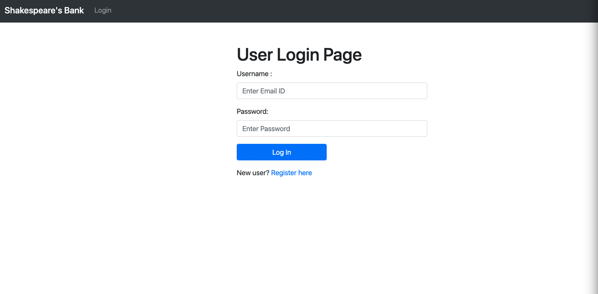

# uci-266p-bank-app

This repository contains a sample Java SpringBoot web application that mimics a banking
application. It contains several vulnerabiltiies and is only intended to be used in a
sandbox environment for educational purposes.

### Requirements
- Java Version 11
- Apache Maven 3.8.4

### Run Time Instructions

1. Clone this repository: `git clone ...`
2. Navigate to the parent project directory: `cd uci-266p-bank-app/`
3. Run `mvn clean install`. This will create a JAR in the target directory in the project directory.
4. Run the application with `java -jar target/java -jar target/app-0.0.1-SNAPSHOT.jar `
5. Open a browser and navigate to `http://localhost:8080/`
6. You should be prompted with a login page.

### To Do
- [ ] Introduce 4 Vulnerabilities
- [ ] Write Report On Secure Code and Vulnerabilities
- [ ] Create a static release for use https://docs.github.com/en/repositories/releasing-projects-on-github/managing-releases-in-a-repository